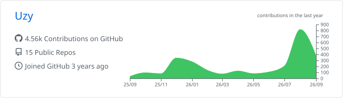
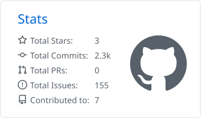
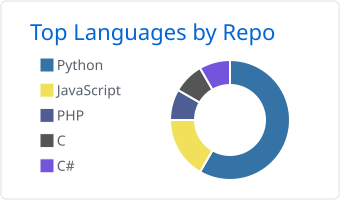

<h1 align="center">Hey, I'm Uzy 👋</h1>

  Full-stack developer building web, mobile and whatever else seems interesting.

  <a href="https://uzy777.dev">Website</a>
  &nbsp;•&nbsp;
  <a href="https://github.com/Uzy777?tab=repositories">Projects</a>

 

  

 

## 👋 About me

* 💻 Building full-stack web and mobile applications
* 🐧 Daily driving Arch Linux + Hyprland
* ☁️ AWS Certified Cloud Practitioner
* 🧠 Usually learning something by building it
* 🚗 Cars are probably my other dependency

---

## 🛠️ Tech

### Systems

  

<!-- TODO: Hyprland isn't currently available on skillicons.dev -->

### Languages

  

### Frontend & Mobile

  

<!-- TODO: Expo isn't currently available on skillicons.dev -->

<!-- TODO: React Native doesn't have an official separate skillicons.dev icon -->

### Backend & Data

  

### Cloud & DevOps

  

<!-- TODO: Argo CD isn't currently available on skillicons.dev -->

### Tools & Workflow

  

<!-- TODO: Jira isn't currently available on skillicons.dev -->

  
<strong>Other technologies </strong>

   

  

    
  

  <!-- TODO: Joomla isn't currently available on skillicons.dev -->

  <!-- TODO: Pega isn't currently available on skillicons.dev -->

`Joomla` · `Pega`

---

## 🚀 Building

### No More Later

Gamified productivity and focus tracking — built to make actually starting things a little easier.

`React Native` · `Expo` · `TypeScript` · `Supabase`

### Uzy Analytics

A lightweight analytics platform with its own event collection API and dashboard.

`React` · `TypeScript` · `Cloudflare`

### My Salah

A mobile prayer tracker focused on making daily Salah progress simple and meaningful.

`React Native` · `Expo` · `TypeScript`

---

## 📊 GitHub

  <picture>
    <source
      media="(prefers-color-scheme: dark)"
      srcset="./profile-summary-card-output/github_dark/0-profile-details.svg"
    />
    <source
      media="(prefers-color-scheme: light)"
      srcset="./profile-summary-card-output/github/0-profile-details.svg"
    />
    
  </picture>

  <picture>
    <source
      media="(prefers-color-scheme: dark)"
      srcset="./profile-summary-card-output/github_dark/3-stats.svg"
    />
    <source
      media="(prefers-color-scheme: light)"
      srcset="./profile-summary-card-output/github/3-stats.svg"
    />
    
  </picture>

  <picture>
    <source
      media="(prefers-color-scheme: dark)"
      srcset="./profile-summary-card-output/github_dark/1-repos-per-language.svg"
    />
    <source
      media="(prefers-color-scheme: light)"
      srcset="./profile-summary-card-output/github/1-repos-per-language.svg"
    />
    
  </picture>

---

  <a href="https://uzy777.dev">uzy777.dev</a>

